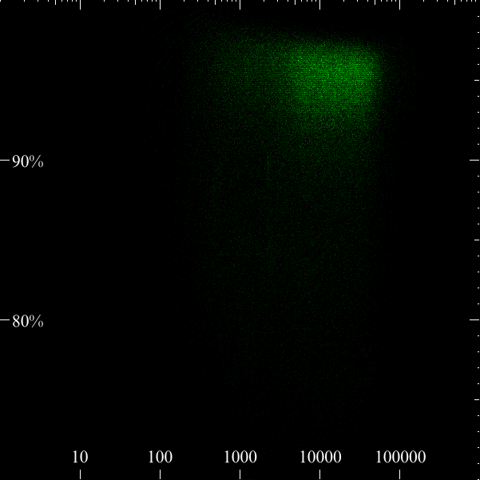

# kyber

Tool to quickly make a minimalistic 600x600 pixels image of read length (log transformed) and read accuracy.

## DETAILS

Both the x and y axis are fixed, allowing for comparison across datasets. The current settings should work for most (long-read) datasets, let me know if you disagree.
The x-axis has log transformed read lengths, with a maximum length of 1M.
The y-axis has the gap-compressed reference identity, ranging from 70% to 100%. When using Phred-scaled accuracy scores, the y-axis ranges from Q0 to Q40.

A 150 gigabase BAM file (from ONT PromethION) is processed in 11 minutes using 4 decompression threads (the default). If your input dataset is *very* large, you may want to consider to downsample it with `samtools view -h` and pipe that to kyber, e.g. `samtools view -h -s 0.05 alignment.cram | kyber -`

My intention for this tool is to be minimalistic, without too many bells and whistles. But please let me know if you are missing a feature.

## EXAMPLE

Gap-compressed percent identity             |  Phred-scale accuracy
:-------------------------:|:-------------------------:
  |  

## INSTALLATION

Download the appropriate binary from the [releases](https://github.com/wdecoster/kyber/releases).

## USAGE

```text
Usage: kyber [OPTIONS] <INPUT>

Arguments:
  <INPUT>  cram or bam file, or use `-` to read from stdin

Options:
  -t, --threads <THREADS>  Number of parallel decompression threads to use [default: 4]
  -o, --output <OUTPUT>    Output file name [default: accuracy_heatmap.png]
  -c, --color <COLOR>      Color used for heatmap [default: green] [possible values: red, green, blue, purple, yellow]
  -p, --phred              Plot accuracy in phred scale
  -h, --help               Print help
  -V, --version            Print version
```
